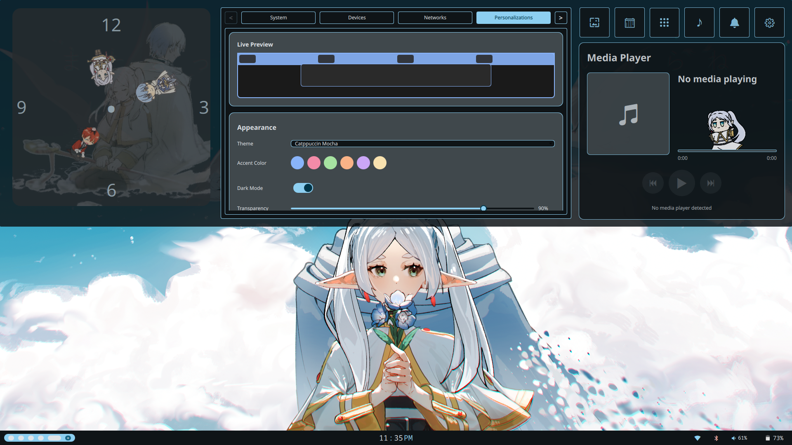
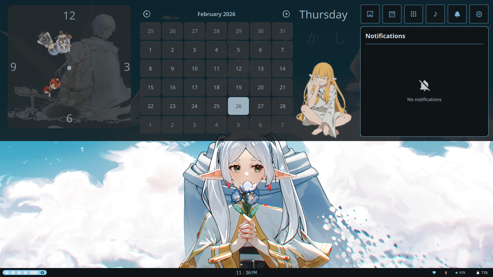
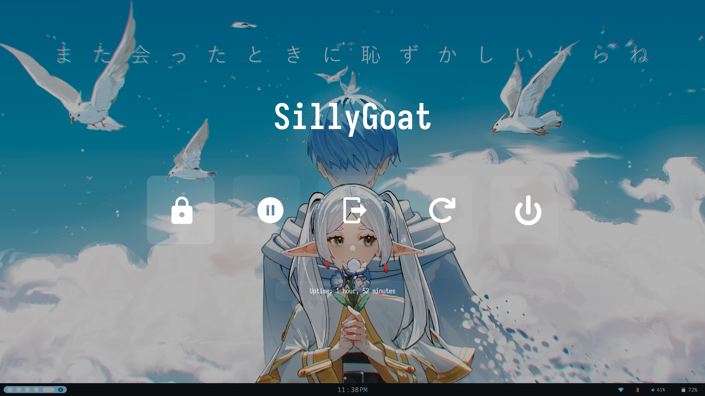
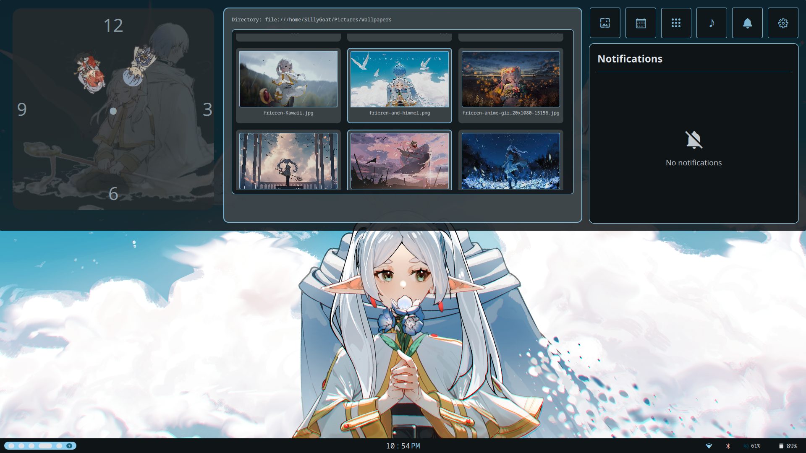

# Mumbl3-Shell
❄️ A Frieren-themed Quickshell config for Hyprland featuring dropdown panel, media controls, dynamic colors, and more. Pure QML on Arch Linux.


# Mumbl3-Shell

<div align="center">


*A Frieren-themed Quickshell configuration for Hyprland*

**Inspired by [fri(no)rain(no)bar](github.com/Rexcrazy804/Zaphkiel/tree/quickshell-3/users/Configs/quickshell/frierainbar)**

[Features](#-features) • [Installation](#-installation) • [Screenshots](#-screenshots) • [Tips & Tricks](#-tips--tricks) • [Roadmap](#-roadmap)

---

### 💎 Made by the Dream Team

**[Botros](https://github.com/BotrosDev)** - The Greatest Developer That Ever Lived  
**[MumbleGameZ](https://github.com/MumbleGameZ)** - The Greatest Developer Team That Ever Lived  
**[EmiliaCatgirl](https://github.com/EmiliaCatgirl)** - The Greatest Catgirl That Ever Lived

🌟 *Stay updated! Join our [Discord Server](https://discord.gg/UDu85xgvQc) for the latest news and updates. Joining using this link will grant you the "OG Council" role!*

</div>

---

## 📖 About

Mumbl3-Shell is a comprehensive Frieren-themed Quickshell setup designed for Hyprland on Arch Linux. Built with QML and inspired by the excellent fri(no)rain(no)bar, this project features a unique dropdown panel system with extensive customization capabilities.

**Note:** This project is actively being developed. The core dropdown panel is functional, but many settings and advanced features are currently UI mockups showing the planned design. See the [Roadmap](#-roadmap) for details on what's working and what's coming next.

### 🎨 Design Philosophy

The dropdown panel concept was inspired by fri(no)rain(no)bar (used with explicit permission from the original author), but has been heavily modified, rebuilt, and extended with new features and Frieren-themed aesthetics.

## ✨ Features

### Currently Working

- **❄️ Dropdown Panel System** - Hidden top bar that slides down with smooth Material Design animations
- **🎵 Media Player** - Full playback controls with album art (includes a special easter egg!)
- **🔔 Notification System** - Custom notification server with popup management
- **📅 Calendar & Clock** - Beautiful time display with expandable calendar view
- **🖼️ Wallpaper Selector** - Built-in wallpaper management powered by Swww
- **💼 Workspace Management** - Interactive Hyprland workspace indicators with right-click for extended view
- **🔊 Audio Controls** - Volume slider with quick mute functionality
- **💡 Brightness Controls** - Screen brightness adjustment (actually functional!)
- **🔋 Battery Monitor** - Adaptive battery icons
- **📶 WiFi Widget** - Network status display
- **🎨 Matugen Integration** - Dynamic color theming system

### UI Mockups (Planned Features)

The following are beautifully designed UI previews showing the planned functionality:
- **⚙️ Settings Panel** - 8 tab system (Accounts, Data, System, Devices, Networks, Personalization, Power, Privacy)
- **🚀 Integrated App Launcher** - Built-in Quickshell launcher (replacing Rofi)
- **📋 System Tray** - Application tray integration
- **📎 Clipboard Manager** - Clipboard history in pure QML
- **📸 Screenshot Tool** - Custom screenshot utility
- **🎥 Screen Recorder** - Built-in recording functionality
- **🔒 Lock Screen** - QML-based screen lock
- **🚪 Boot Menu** - Custom boot interface

## 🎨 Color System

Mumbl3-Shell uses **matugen** for dynamic color generation:

1. Matugen generates a color palette based on your wallpaper
2. Colors are saved to `~/.local/share/quickshell/colors.json`
3. `Colors.qml` in the Data folder reads and exposes these colors throughout the shell

This means your entire UI theme adapts to match your current wallpaper!

## 📸 Screenshots






## 🚀 Installation

### Prerequisites

- **[Quickshell](https://github.com/quickshell-community/quickshell)** - QML shell framework
- **[Hyprland](https://hyprland.org/)** - Wayland compositor
- **Arch Linux** - Primary target (may work on other distros)
- **[Matugen](https://github.com/InioX/matugen)** - Color generation from wallpaper
- **[Swww](https://github.com/LGFae/swww)** - Wallpaper daemon
- **[Rofi](https://github.com/davatorium/rofi)** - App launcher (temporary, will be replaced)

### Optional Dependencies

- **Pipewire/Wireplumber** - For audio control
- **Bluez** - For Bluetooth functionality
- **NetworkManager** - For network management

### Installation Steps

1. **Clone the repository**
   ```bash
   git clone https://github.com/yourusername/Mumbl3-Shell.git
   cd Mumbl3-Shell
   ```

2. **Backup existing config** (if any)
   ```bash
   mv ~/.config/quickshell ~/.config/quickshell.backup
   ```

3. **Install the configuration**
   ```bash
   cp -r bar ~/.config/quickshell/
   ```

4. **Install dependencies**
   ```bash
   # Using yay
   yay -S quickshell-git hyprland matugen swww rofi pipewire wireplumber bluez networkmanager
   ```

5. **Generate initial colors** (optional but recommended)
   ```bash
   matugen image /path/to/your/wallpaper.png
   ```

6. **Launch Quickshell**
   ```bash
   quickshell
   ```

## 🎮 Tips & Tricks

### Interactive Elements

- **Right-click workspace circles** → Reveals all 10 workspaces
- **Click the clock** → Shows full date with calendar
- **Click the audio icon** → Quick mute/unmute
- **Click Chibi Frieren (kuru kuru)** → Easter egg! See below ⬇️

### 🥚 Easter Egg

Want to unlock a special detail in the media player?

1. Navigate to `~/.config/quickshell/bar/dropdownPanel/DropdownPanelWindow.qml`
2. Go to line ~230
3. Remove the big comment block
4. Spam clicks on the chibi Frieren doing the kuru kuru
5. Enjoy! ❄️

## 📁 Project Structure

```
~/.config/quickshell/bar/
├── Assets/                    # Frieren-themed images and GIFs
│   ├── frieren-kuru-kuru.gif
│   ├── FrierenHeart.png
│   ├── sleepOnHimmel.png
│   └── ... (more Frieren goodness)
│
├── dropdownPanel/            # Main dropdown panel
│   ├── Data/                 # Core data providers
│   │   ├── Colors.qml       # 🎨 Matugen color integration
│   │   ├── Audio.qml        # Audio management
│   │   ├── Clock.qml        # Time/date logic
│   │   ├── Globals.qml      # Global state
│   │   └── ...
│   │
│   ├── Generics/            # Reusable components
│   │   ├── MatIcon.qml
│   │   ├── AudioSlider.qml
│   │   ├── Notification.qml
│   │   └── ...
│   │
│   ├── modules/             # Feature modules
│   │   ├── MediaPlayer.qml
│   │   ├── Calendar.qml
│   │   ├── Notif.qml
│   │   ├── Settings.qml     # (UI mockup)
│   │   └── ...
│   │
│   ├── WallpaperSelector/   # Wallpaper management
│   └── DropdownPanelWindow.qml  # Main panel window
│
├── modules/                 # Bar modules
│   ├── bar/
│   │   ├── Bar.qml         # Top bar definition
│   │   ├── BarClock.qml
│   │   ├── Workspace.qml
│   │   └── ...
│   │
│   ├── widgets/            # System widgets
│   │   ├── Battery.qml
│   │   ├── Volume.qml
│   │   ├── WiFi.qml
│   │   └── ...
│   │
│   └── images/             # Theme icons
│       ├── theme-dark/
│       └── theme-light/
│
└── shell.qml               # Main entry point
```

## 🎨 Customization

### Changing Colors

Edit `bar/dropdownPanel/Data/Colors.qml` or regenerate with matugen:
```bash
matugen image /path/to/new/wallpaper.png
```

### Adjusting Fonts

Modify `bar/dropdownPanel/Data/Fonts.qml`

### Animation Tweaks

Edit `bar/dropdownPanel/Data/MaterialEasing.qml`

### Adding Custom Assets

Place images/GIFs in `bar/Assets/` and reference them in your QML components

## 🗺️ Roadmap

### ✅ Phase 1: Core Panel (Current)
- [x] Dropdown panel system
- [x] Media player integration
- [x] Notification system
- [x] Calendar widget
- [x] Wallpaper selector
- [x] Basic system widgets (battery, audio, WiFi, brightness)
- [x] Workspace management
- [x] Matugen color integration

### 🚧 Phase 2: Settings Implementation (In Progress)
- [ ] Make all 8 settings tabs functional
  - [ ] Accounts Tab (profile, sessions, user groups)
  - [ ] Data Tab (storage monitoring, cleanup tools, backup)
  - [ ] System Tab (CPU/GPU/RAM gauges, disk info)
  - [ ] Devices Tab (display settings, audio, input devices)
  - [ ] Networks Tab (WiFi, Bluetooth, advanced options)
  - [ ] Personalization Tab (themes, appearance, layout)
  - [ ] Power Tab (battery management, power profiles)
  - [ ] Privacy Tab (firewall, updates, logging)

### 🔮 Phase 3: Core Tools
- [ ] Pure QML App Launcher (replace Rofi)
- [ ] System Tray integration
- [ ] Clipboard manager (QML-based)
- [ ] Screenshot tool
- [ ] Screen recorder
- [ ] Lock screen
- [ ] Boot menu

### 🌟 Phase 4: Polish & Extras
- [ ] Optional rounded corners with screen frame
- [ ] Alternative panel design for framed mode
- [ ] Performance optimizations
- [ ] Documentation improvements
- [ ] Video tutorials

See [TASKS.md](TASKS.md) for detailed task breakdown.

## 🐛 Troubleshooting

### Panel won't appear
```bash
# Check Quickshell logs
quickshell --help

# Verify Hyprland is running
hyprctl version
```

### Colors not loading
```bash
# Regenerate color palette
matugen image /path/to/wallpaper.png

# Check if JSON was created
ls ~/.local/share/quickshell/colors.json
```

### Widgets not responding
- Ensure required daemons are running (Pipewire, Bluez, NetworkManager)
- Check DBus services: `systemctl --user status`

### Media player not showing
- Install MPRIS-compatible media player
- Verify MPRIS support: `busctl --user list | grep mpris`

## 🤝 Contributing

This is a passion project, but contributions are welcome!

- 🐛 Report bugs
- 💡 Suggest features
- 🔧 Submit pull requests
- 📖 Improve documentation
- 💬 Join our Discord community

### Development Notes

- Some code in the `Data/` folder is inherited from fri(no)rain(no)bar (used with permission)
- The dropdown panel concept is inspired by fri(no)rain(no)bar but extensively modified
- New modules are entirely custom-built
- All Frieren assets are properly sourced

## 📝 License

This project is licensed under the MIT License - see the [LICENSE](LICENSE) file for details.

## 🙏 Acknowledgments

- **[fri(no)rain(no)bar](github.com/Rexcrazy804/Zaphkiel/tree/quickshell-3/users/Configs/quickshell/frierainbar)** - For the dropdown panel inspiration and permission to use code
- **[Quickshell](https://github.com/quickshell-community/quickshell)** - For the amazing QML shell framework
- **[Hyprland](https://hyprland.org/)** - For the best Wayland compositor experience
- **[Matugen](https://github.com/InioX/matugen)** - For dynamic color theming
- **Frieren: Beyond Journey's End** - For the beautiful aesthetic that makes this shell special ❄️✨

## 📬 Contact & Support

- **Discord:** [Join our server](#) for updates and support
- **Issues:** [GitHub Issues](https://github.com/BotrosDev/Mumbl3-Shell/issues)
- **Discussions:** [GitHub Discussions](https://github.com/BotrosDev/Mumbl3-Shell/discussions)

---
<div align="center">
   
**Made with ❄️ by QML nerds for Hyprland enthusiasts**

*"The journey continues..."*

If you find this useful, consider giving it a ⭐!
</div>
